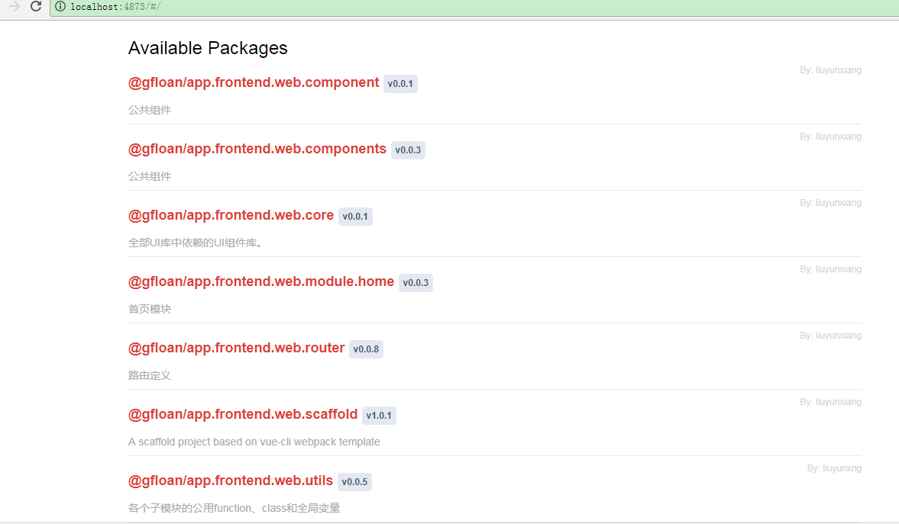

# 依赖关系框架搭建

## 选择vantUI的理由
看中的是有赞作为saas提供商的名气，说实话我并没有使用过组件库

## 每个项目成功发布后在本地私有npm库上的截图

## Node.js的package.json文件当中可以支持哪几种依赖关系
* [dependencies](https://docs.npmjs.com/files/package.json#dependencies)：依赖，项目代码运行时需要的依赖
* [devDependencies](https://docs.npmjs.com/files/package.json#devdependencies): 开发依赖，项目构建过程中需要用到的构建工具依赖
* [peerDependencies](https://docs.npmjs.com/files/package.json#peerdependencies): 同伴(?)依赖，项目运行过程中需要的依赖，但在打包发布的的时候又不需要引入，一般是在开发某个库的插件的时候需要用到，类似说明该项目是哪个库的插件
* [bundledDependencies](https://docs.npmjs.com/files/package.json#bundleddependencies)：捆绑依赖，项目发布包中捆绑的依赖，当你想让你的发布包只依赖一个文件就能使用的时候需要定义
* [optionalDependencies](https://docs.npmjs.com/files/package.json#optionaldependencies):可选依赖,这个依赖在发布包中可以有，也可以没有，如果找不到或无法安装，让npm去处理，但是在代码中会根据有没有这个依赖包做不同的处理

## 编译、执行各模块代码所需进行的ide配置
