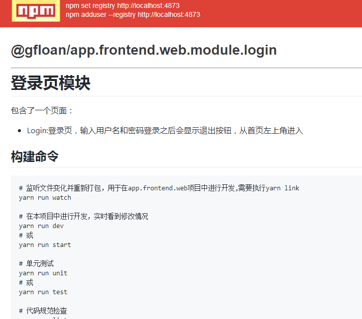

# 登录页模块

包含了一个页面：
* Login:登录页，输入用户名和密码登录之后会显示退出按钮，从首页左上角进入

## 构建命令

``` bash
# 监听文件变化并重新打包，用于在app.frontend.web项目中进行开发,需要执行yarn link
yarn run watch

# 在本项目中进行开发，实时看到修改情况
yarn run dev
# 或
yarn run start

# 单元测试
yarn run unit
# 或
yarn run test

# 代码规范检查
yarn run lint

# 项目打包，用于在app.frontend.web项目中进行开发
yarn run devbuild

# 项目发布前打包
yarn run build

# 生成文档
yarn run doc

# 打包并发布到npm库
yarn run pub

# 重新安装依赖并发布到npm库
yarn run repub

# 重新安装依赖并进入本地开发模式
yarn run redev

# 重新安装依赖并发布到npm库，并且提交到远程git
yarn run pp <你的git提交信息>
```

## 发布截图
