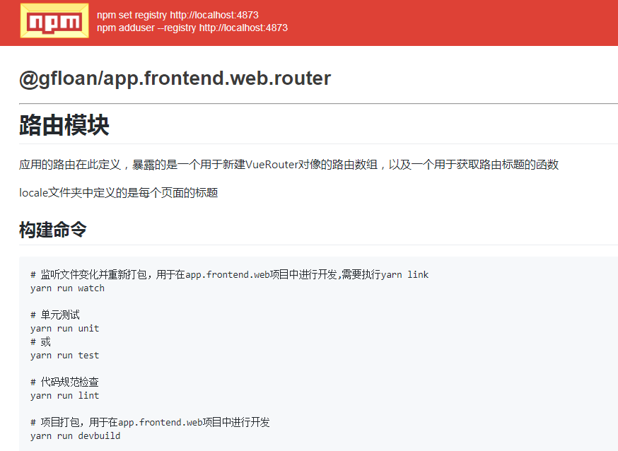

# 路由模块

应用的路由在此定义，暴露的是一个用于新建VueRouter对像的路由数组，以及一个用于获取路由标题的函数

locale文件夹中定义的是每个页面的标题

## 构建命令

``` bash
# 监听文件变化并重新打包，用于在app.frontend.web项目中进行开发,需要执行yarn link
yarn run watch

# 单元测试
yarn run unit
# 或
yarn run test

# 代码规范检查
yarn run lint

# 项目打包，用于在app.frontend.web项目中进行开发
yarn run devbuild

# 项目发布前打包
yarn run build

# 生成文档
yarn run doc

# 打包并发布到npm库,且成生文档
yarn run pub

# 重新安装依赖并发布到npm库
yarn run repub

# 更新@gfloan下的所有包，本地化之后可能没有什么用了
yarn run up

```

需要说明的问题是：

因为该项目依赖于common,home,login三个子项目，所以当上述三个子项目代码发生了变动的时候，router项目需要重新打包。

但是经过实验，webpack在watch模式下即使定义了watchOption让其监听node_modules文件夹的变化，当上述三个项目发生变化的时候，也不会重新打包**(可能是我的配置还有一些问题)**,所以开发过程中，我经常是手动对该项目进行重新打包

## 发布截图
