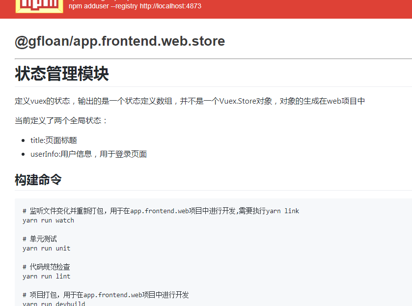

# 状态管理模块

定义vuex的状态，输出的是一个状态定义数组，并不是一个Vuex.Store对象，对象的生成在web项目中

当前定义了两个全局状态：
* title:页面标题
* userInfo:用户信息，用于登录页面

## 构建命令

``` bash
# 监听文件变化并重新打包，用于在app.frontend.web项目中进行开发,需要执行yarn link
yarn run watch

# 单元测试
yarn run unit

# 代码规范检查
yarn run lint

# 项目打包，用于在app.frontend.web项目中进行开发
yarn run devbuild

# 项目发布前打包
yarn run build

# 生成文档
yarn run doc

# 打包并发布到npm库,且成生文档
yarn run pub
```

## 发布截图
