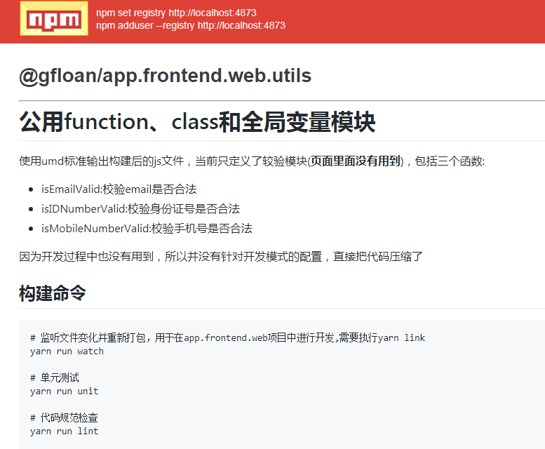

# 公用function、class和全局变量模块

使用umd标准输出构建后的js文件，当前只定义了较验模块(**页面里面没有用到**)，包括三个函数:
* isEmailValid:校验email是否合法
* isIDNumberValid:校验身份证号是否合法
* isMobileNumberValid:校验手机号是否合法

因为开发过程中也没有用到，所以并没有针对开发模式的配置，直接把代码压缩了


## 构建命令

``` bash
# 监听文件变化并重新打包，用于在app.frontend.web项目中进行开发,需要执行yarn link
yarn run watch

# 单元测试
yarn run unit

# 代码规范检查
yarn run lint

# 项目发布前打包
yarn run build

# 生成文档
yarn run doc

# 打包并发布到npm库,且成生文档
yarn run pub
```

## 发布截图
